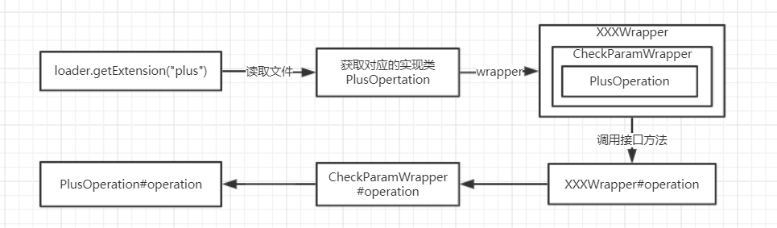

## SPI

SPI(Service Provider Interface) 服务提供接口技术，SPI 的本质是**将接口实现类的全限定名配置在文件中，并由服务加载器读取配置文件，加载实现类**。这样可以在运行时，**动态为接口替换实现类**。正因此特性，我们可以很容易的通过 SPI 机制为我们的程序提供拓展功能。SPI 机制在第三方框架中也有所应用，比如 Dubbo 就是通过 SPI 机制加载所有的组件。

在针对某一领域进行模块化开发的时候，往往会存在不同的实现方案，但是都会遵循一定的规则(接口)进行设计。比如常见的日志模块，xml解析模块，JDBC驱动模块。我们使用这些模块时往往采用面向接口编程的方式进行对接，因为方便更换某些技术实现。但是为什么可以直接更换实现类呢？

SPI技术可以根据已知的接口构建不同的实现类，并且在外部调用时，从这些实现类选择自己需要的外部实现。

### JAVA SPI

目录结构：

```tex
src
 main
  java
   api
   impl
  resources
   /META-INF/services/[interfaceName]
```

接口：

```java
public interface top.gmfcj.JavaSpiMain.OperationService {
    public void operation();
}
```

实现类

```java
public class top.gmfcj.impl.PlusOperationImpl implements top.gmfcj.JavaSpiMain.OperationService {
    @Override
    public void operation() {
        System.out.println("plus operation ");
    }
}
```

```java
public class top.gmfcj.impl.DivisionOperationService implements top.gmfcj.JavaSpiMain.OperationService {
    @Override
    public void operation() {
        System.out.println("division operation service");
    }
}
```

top.gmfcj.api.OperationService文件内容

```tx
# 文件名对应接口的实现类
top.gmfcj.impl.top.gmfcj.impl.DivisionOperationService
top.gmfcj.impl.top.gmfcj.impl.PlusOperationImpl
```

测试

```java
public static void main(String[] args) {
    // 核心代码，就是加载所有的类
    ServiceLoader<top.gmfcj.JavaSpiMain.OperationService> services= ServiceLoader.load(top.gmfcj.JavaSpiMain.OperationService.class);
    Iterator<top.gmfcj.JavaSpiMain.OperationService> iterator = services.iterator();
    while(iterator.hasNext()){
        top.gmfcj.JavaSpiMain.OperationService service = iterator.next();
        System.out.println(service.getClass().getName());
        service.operation();
    }
}
```

### Dubbo SPI

 Dubbo SPI支持在配置文件中配置实现类的别名，获取的时候，可以通过key获取指定的实现类。

配置文件

```properties
top.gmfcj.wrapper.CheckOperationWrapper
top.gmfcj.wrapper.CacheOperationWrapper
division=top.gmfcj.impl.DivisionOperationService
plus=top.gmfcj.impl.PlusOperationService
```

测试程序

```java
public static void main(String[] args) {
    ExtensionLoader<OperationService> loader = ExtensionLoader.getExtensionLoader(OperationService.class);
    OperationService service = loader.getExtension("plus");
    service.operation();
}
```

配置文件可以存在以下三种路径：

+ META-INF/dubbo/
+ META-INF/dubbo/internal/
+ META-INF/services/

**文件名称依然是接口的全类名**

Dubbo中的AOP编程，只需要写一个类实现对应的接口，并且通过构造函数将需要代理的对象注入到成员变量中，在接口的方法对实现类的方法处理进行增强

```java
public class CheckOperationWrapper implements OperationService {

    private OperationService operationService;

    public CheckOperationWrapper(OperationService operationService){
        this.operationService = operationService;
    }
    @Override
    public void operation() {
        System.out.println("校验参数开始....");
        operationService.operation();
        System.out.println("校验参数结束....");
    }
}
```

### Wrapper流程分析




### Dubbo自动注入

1、接口

```java
@SPI
public interface DemoService {
	// 这里的url参数是必须的
    @Adaptive("demo")
    public String say(String content, URL url);
}
```

2、实现类

```java
public class DemoServiceImpl1 implements DemoService {
    @Override
    public String say(String content, URL url) {
        return content + "impl 1";
    }
}
```

3、需要注入的类

```java
public class IndexService implements DemoService {
    private DemoService demoService;
	// 通过set方法注入
    public void setDemoService(DemoService demoService) {
        this.demoService = demoService;
    }
    @Override
    public String say(String content, URL url) {
        System.out.println("干哈呢？");
        return demoService.say(content, url);
    }
}
```

4、接口文件

```properties
impl1=top.gmfcj.demo.DemoServiceImpl1
index=top.gmfcj.demo.IndexService
```

5、测试自动注入

```java
public static void main(String[] args) {
	ExtensionLoader<DemoService> loader = ExtensionLoader.getExtensionLoader(DemoService.class);
    Map<String, String> params = new HashMap<>();
    params.put("demo", "impl1");
    URL url = new URL("", "", 1, params);
    DemoService index = loader.getExtension("index");
    // 干哈呢？
	// hello injectimpl 1
    System.out.println(index.say("hello inject", url));
}
```

### 注入的原理分析

+ 每一个ExtensionLoader对象都需要去加载一个ExtensionFactory接口的实现类，而它的实现类存在两个，因为有一个实现类存在@Adaptive注解，所以默认就会加载这个类而不会去加载另一个SpiExtensionFactory类
+ 但是在AdaptiveExtensionFactory的构造方法中，再次去加载了ExtensionFactory接口的实现类。这时会直接从cachedClasses的缓存中获取，但是被@Adaptive注解了的实现类不会放入cachedClasses中

```java
@Adaptive
public class AdaptiveExtensionFactory implements ExtensionFactory{
    // 构造方法
    public AdaptiveExtensionFactory() {
        ExtensionLoader<ExtensionFactory> loader = ExtensionLoader.getExtensionLoader(ExtensionFactory.class);
        List<ExtensionFactory> list = new ArrayList<ExtensionFactory>();
        // 从cachedClasses中获取 => SpiExtensionFactory
        for (String name : loader.getSupportedExtensions()) {
            list.add(loader.getExtension(name));
        }
        factories = Collections.unmodifiableList(list);
    }
}
public class SpiExtensionFactory implements ExtensionFactory
```

+ 当通过`loader.getExtension("index")`去加载一个实现类时，会在`injectExtension`方法中维护这个类的依赖。

```java
if (method.getName().startsWith("set") && method.getParameterTypes().length == 1
    && Modifier.isPublic(method.getModifiers())) {
    // objectFactory中获取对应的依赖对象,如果存在注入的set方法，会在这里注入
    // pt就是set方法的参数类型 
    // property set方法后面的名称  setAno -> ano
    Object object = objectFactory.getExtension(pt, property);
    if (object != null) {
        method.invoke(instance, object); // set方法
    }
}
```

+ 这时就会进入AdaptiveExtensionFactory#getExtension方法

```java
public <T> T getExtension(Class<T> type, String name) {
    for (ExtensionFactory factory : factories) {
        // factory => SpiExtensionFactory
        T extension = factory.getExtension(type, name);
        if (extension != null) {
            return extension;
        }
    }
    return null;
}
```

+ 进入SpiExtensionFactory#getExtension方法

```JAVA
 public <T> T getExtension(Class<T> type, String name) {
     // 检查
     if (type.isInterface() && type.isAnnotationPresent(SPI.class)) {
         ExtensionLoader<T> loader = ExtensionLoader.getExtensionLoader(type);
         // 存在没有被@Adaptive注解的实现类
         if (!loader.getSupportedExtensions().isEmpty()) {
             // 返回一个adaptiveClass
             return loader.getAdaptiveExtension();
         }
     }
     return null;
 }	
```

+ 首先会去cachedAdaptiveInstance缓存中获取，如果预先加载过这个接口，在解析所有的实现类时，会将存在@Adaptive注解的实现类赋值给cachedAdaptiveInstance。**一个接口只能存在一个@Adaptive注解的实现类**
+ 如果缓存中没有，会通过`ExtensionLoader#getAdaptiveExtensionClass`方法去创建一个Class

```java
private Class<?> createAdaptiveExtensionClass() {
    // 使用字符串拼接出一个class文件
    String code = createAdaptiveExtensionClassCode();
    ClassLoader classLoader = findClassLoader();
    org.apache.dubbo.common.compiler.Compiler compiler = ExtensionLoader.getExtensionLoader(org.apache.dubbo.common.compiler.Compiler.class).getAdaptiveExtension();
    // 将字符串编译为class
    return compiler.compile(code, classLoader);
}
```

使用arthas查看这里生产的class源码

```java
public class DemoService$Adaptive implements DemoService {
    public String say(String string, URL uRL) {
        if (uRL == null) {
            throw new IllegalArgumentException("url == null");
        }
        URL uRL2 = uRL; 
        // 这个demo就是@Adaptive注解中的值  没有名字就会根据接口分割 DemoService->demo.service
        String string2 = uRL2.getParameter("demo");
        if (string2 == null) {
            throw new IllegalStateException(new StringBuffer().append("Fail to get extension(top.gmfcj.api.DemoService) name from url(").append(uRL2.toString()).append(") use keys([demo])").toString());
        }
        DemoService demoService = (DemoService)ExtensionLoader.getExtensionLoader(DemoService.class).getExtension(string2);
        return demoService.say(string, uRL);
    }
	// 这个方法没有@Adaptive注解 在生成的代理class中就直接抛出了异常
    public void eat() {
        throw new UnsupportedOperationException("method public abstract void top.gmfcj.api.DemoService.eat() of interface top.gmfcj.api.DemoService is not adaptive method!");
    }
}
```

+ 这个生成的class就会生成一个对象注入到之前的set方法中

总结：

+ dubbo中自动注入的对象实际就是一个根据接口（@SPI/@Adaptive）生成的xxx$Adaptive代理对象
+ 这个代理对象会根据@Adaptive中指定的name去获取真正的对象来执行目标方法
+ 这种自动注入的模式必须存在URL参数，因为在生成的代理Adaptive对象中，如果没有URL对象会直接抛出异常


