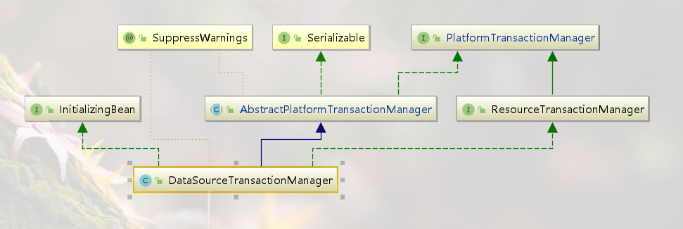
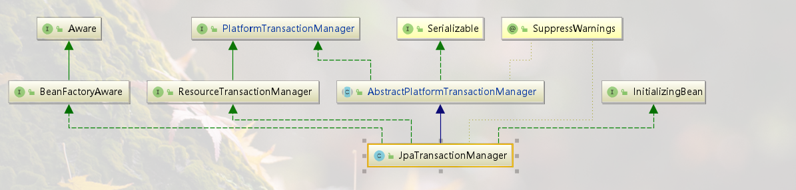

## Transaction Management

spring中的事务管理器

+ 通用的事务管理模型，支持java事务、JDBC事务、Hibernate事务、JPA事务
+ 支持声明式事务管理
+ API更加简单
+ 与Spring的数据访问框架无缝集成

需要了解事务管理的点

+ 事务抽象模型，使用与大部分的事务管理场景
+ 事务管理核心类，数据源配置
+ 关联事务和资源文件的关联和资源管理
+ 声明式事务
+ 编程式事务
+ 如何在事务中使用应用程序事件

Spring事务管理器优点

+ Spring解决了全局事务和本地事务的缺点。
+ 程序开发人员在任何环境中使用一致的编程模型。编写一次代码，就可以在不同环境中的管理事务
+ Spring框架同时提供了声明式和编程式事务管理

### PlatformTransactionManager

> 理解Spring事务模型的关键是理解spring事务的策略`org.springframework.transaction.PlatformTransactionManager`

接口的定义

```java
public interface PlatformTransactionManager {
	// TransactionStatus存在两种情况
    // 1、如果当前调用堆栈中存在匹配的事务，则这个返回的事务可以表示新事务，也可以代表现有事务
    // 2、与线程绑定，表示当前线程的事务
    TransactionStatus getTransaction(TransactionDefinition definition) throws TransactionException;
	// 提交
    void commit(TransactionStatus status) throws TransactionException;
	// 回滚
    void rollback(TransactionStatus status) throws TransactionException;
}
```

TransactionDefinition接口

```java
public interface TransactionDefinition {
	// 事务的传播行为
	int PROPAGATION_REQUIRED = 0; //如果当前没有事务，就新建一个事务，如果已经存在一个事务中，加入到这个事务中
	int PROPAGATION_SUPPORTS = 1;//支持当前事务，如果当前没有事务，就以非事务方式执行
	int PROPAGATION_MANDATORY = 2;//使用当前的事务，如果当前没有事务，就抛出异常
	int PROPAGATION_REQUIRES_NEW = 3;//新建事务，如果当前存在事务，把当前事务挂起
	int PROPAGATION_NOT_SUPPORTED = 4;//以非事务方式执行操作，如果当前存在事务，就把当前事务挂起
	int PROPAGATION_NEVER = 5;//以非事务方式执行，如果当前存在事务，则抛出异常
	int PROPAGATION_NESTED = 6;//如果当前存在事务，则在嵌套事务内执行；没有事务，创建一个事务
	// 事务的隔离级别 默认使用数据默认的隔离级别
    // Mysql 默认:可重复读
    // Oracle、SqlServer 默认:读已提交
    // read uncommited 最低的事务隔离界别，允许一个事务可以读到其他事务未提交的事务
    // read commited 保证一个事物提交后才能被另外一个事务读取
    // repeatable read 保证一个事务在另一个事务开始或者结束时读取数据一致
    // serializable 串行化
    // 不可重复读的问题是在A事务读取数据后，B事务操作了A事务中的数据并提交了，当A事务去操作数据时，发现数据和最初读到的数据不一致
	int ISOLATION_DEFAULT = -1;
    // 读未提交（1） => 脏读(读到了未提交的数据)、幻读、不可重复读、丢失更新
	int ISOLATION_READ_UNCOMMITTED = Connection.TRANSACTION_READ_UNCOMMITTED;
    // 读已提交（2）=> 幻读、不可重复读、丢失更新
	int ISOLATION_READ_COMMITTED = Connection.TRANSACTION_READ_COMMITTED;
    // 可重复读（4）=> 幻读、丢失更新
	int ISOLATION_REPEATABLE_READ = Connection.TRANSACTION_REPEATABLE_READ;
    // 序列化（8）不会出现问题
	int ISOLATION_SERIALIZABLE = Connection.TRANSACTION_SERIALIZABLE;
	// 使用底层事务系统的默认超时机制，如果不支持超时，则不支持
    int TIMEOUT_DEFAULT = -1;
	// 获取事务传播行为
    int getPropagationBehavior();
	// 事务事务隔离界别
	int getIsolationLevel();
	int getTimeout();
	// 是否是仅读
	boolean isReadOnly();
	// 返回事务的名称 声明事务name=fullClassName.methodName
	String getName();

}
```

**TransactionStatus** 接口控制事务执行和查询事务状态

```java
public interface TransactionStatus extends SavepointManager, Flushable {
	// 判断当前事务是不是一个全新的事务
	boolean isNewTransaction();
	// 返回此事务是否在内部携带保存点，也就是说是否已基于保存点创建了嵌套事务
	boolean hasSavepoint();
	// 设置为仅回滚模式
	void setRollbackOnly();
	// 判断事务是否标记为仅回滚模式
	boolean isRollbackOnly();
	// Flush the underlying session to the datastore
	void flush();
	// 事务是否已经完成
	boolean isCompleted();

}
```

### 创建事务管理器

> 根据不同的事务管理资源创建不同的事务管理器

+ jdbc datasource => DataSourceTransactionManager
+ sessionFactory   => HibernateTransactionManager





dataSourceTxManager中的afterPropertiesSet方法

```java
public void afterPropertiesSet() { // 校验datasource
    if (getDataSource() == null) {
        throw new IllegalArgumentException("Property 'dataSource' is required");
    }
}
```

jpaTxManager中的afterPropertiesSet方法

```java
public void afterPropertiesSet() {
    if (getEntityManagerFactory() == null) {
        throw new IllegalArgumentException("'entityManagerFactory' or 'persistenceUnitName' is required");
    }
    if (getEntityManagerFactory() instanceof EntityManagerFactoryInfo) {
        EntityManagerFactoryInfo emfInfo = (EntityManagerFactoryInfo) getEntityManagerFactory();
        DataSource dataSource = emfInfo.getDataSource();
        if (dataSource != null) {
            setDataSource(dataSource);// 设置datasource
        }
        JpaDialect jpaDialect = emfInfo.getJpaDialect(); // 数据库方言 -> 比如分页查询 不同的数据方言，查询sql不同
        if (jpaDialect != null) {
            setJpaDialect(jpaDialect);
        }
    }
}
```

> TransactionAwareDataSourceProxy是一个目标数据源的代理，主要目的是增加对spring事务管理的感知

内部类

```java
private class TransactionAwareInvocationHandler implements InvocationHandler 
```


### 声明式事务管理

+ 声明性事务管理可以在任何环境中工作，比如使用JTA或者本地的JDBC、JPA、Hibernate等

+ 可以将事务声明到任何一个类，不仅仅是service
+ spring提供了声明式的回滚规则
+ spring允许使用AOP定制事务
+ spring不支持在远程调用之间传播事务上下文，通常不希望事务跨越远程调用

回滚规则

+ 在配置中声明哪些异常会回滚

配置

```xml
<tx:advice id="txAdvice">
    <tx:attributes>
    <tx:method name="updateStock" no-rollback-for="InstrumentNotFoundException"/>
    <tx:method name="*"/>
    </tx:attributes>
</tx:advice>
```

也可以在代码中捕获异常使用setRollbackOnly方法进行回滚

```java
public void resolvePosition() {
    try {
        // 事务逻辑
    } catch (NoProductInStockException ex) {
        // 触发回滚
        TransactionAspectSupport.currentTransactionStatus().setRollbackOnly();
    }
}
```

### 声明式事务的原理

事务代理的调用过程如下：


[XML配置式声明式事务](https://docs.spring.io/spring-framework/docs/current/spring-framework-reference/data-access.html#transaction-declarative-first-example)

[注解配置声明式事务](https://docs.spring.io/spring-framework/docs/current/spring-framework-reference/data-access.html#transaction-declarative-annotations)

单独使用时，使用@EnableTransactionManagement开始spring的注解事务。

```java
@Import(TransactionManagementConfigurationSelector.class)
public @interface EnableTransactionManagement {
	// 是否使用cglib代理
	boolean proxyTargetClass() default false;
	// 代理模式 PROXY 或者ASPECTJ
	AdviceMode mode() default AdviceMode.PROXY;
	// 指定 transaction advisor 的执行顺序，默认是MAX_VALUE，最小越先执行
	int order() default Ordered.LOWEST_PRECEDENCE;
}
```

```java
public class TransactionManagementConfigurationSelector{
    protected String[] selectImports(AdviceMode adviceMode) {
        // 拿到@EnableTransactionManagement注解中的mode
		switch (adviceMode) {
			case PROXY:
				return new String[] {
                    // 和AOP中导入的一致 AnnotationAwareAspectJAutoProxyCreator
                    AutoProxyRegistrar.class.getName(),
                // BeanFactoryTransactionAttributeSourceAdvisor
                // TransactionAttributeSource
                // TransactionInterceptor
						ProxyTransactionManagementConfiguration.class.getName()};
			case ASPECTJ:
                // determineTransactionAspectClass方法会返回
                // AspectJJtaTransactionManagementConfiguration  AspectJ + JTA
                // AspectJTransactionManagementConfiguration	 AspectJ 
				return new String[] {determineTransactionAspectClass()};
			default:
				return null;
		}
	}
}
```

+ **@Transactional**一般用在公开的方法上。如果注释了受保护的、私有的或者包可见的方法，虽然不会引发错误，但是事务对这些方法时效。如果需要注释非公开方方法，可以使用AspectJ

+ **@Transactional**可以使用到公开类或者接口、接口中的方法、类中的公开方法
+ 在目标对象中的一个方法调用目标对象的另一个方法时，如果另一个方法上存在@Transactional注解，那么这个注解在这里不会生效，不回去调用代理对象的方法。如果需要使用代理对象，可以使用AspectJ的代理模式

@Transactional参数

```java
public @interface Transactional {
	// 指定使用的事务管理器的beanName
	@AliasFor("transactionManager")
	String value() default "";
	// 指定使用的事务管理器的beanName
	@AliasFor("value")
	String transactionManager() default "";
	// 默认的事务传播途径 Propagation#REQUIRED
	Propagation propagation() default Propagation.REQUIRED;
	// 事务的隔离级别 默认使用数据库中的隔离级别
	Isolation isolation() default Isolation.DEFAULT;
	// 事务的超时时间，默认使用底层事务系统中的超时时间
	int timeout() default TransactionDefinition.TIMEOUT_DEFAULT;
	// 是否只读
	boolean readOnly() default false;
	// 配置rollback的异常Class
	Class<? extends Throwable>[] rollbackFor() default {};
	// 配置rollback的className
	String[] rollbackForClassName() default {};
	// 配置不需要rollback的异常Class
	Class<? extends Throwable>[] noRollbackFor() default {};
	// 配置不需要rollback的异常className
	String[] noRollbackForClassName() default {};
}
```

[自定义事务注解，管理事务处理顺序](https://docs.spring.io/spring-framework/docs/current/spring-framework-reference/data-access.html#tx-multiple-tx-mgrs-with-attransactional)

[关于事务的传播](https://docs.spring.io/spring-framework/docs/current/spring-framework-reference/data-access.html#tx-propagation)

### [编程式事务](https://docs.spring.io/spring-framework/docs/current/spring-framework-reference/data-access.html#tx-prog-template)

使用TransactionTemplate对象进行编程式事务的编写

```java
private final TransactionTemplate transactionTemplate;

public SimpleService(PlatformTransactionManager transactionManager) {
    this.transactionTemplate = new TransactionTemplate(transactionManager);
    // 设置transaction的传播途径、隔离级别...
    // this.transactionTemplate.setIsolationLevel
    this.transactionTemplate.setTimeout(30); // 30 seconds
    // and so on ...
}
public Object someServiceMethod() {
   return transactionTemplate.execute ( new TransactionCallbackWithoutResult() {
        protected void doInTransactionWithoutResult(TransactionStatus status) {
            try {
                updateOperation1();
                return resultOfupdateOperation2();
            } catch (SomeBusinessException ex) {
                status.setRollbackOnly();
                return "xxx.xxx.someServiceMethod 方法出现错误，已经回滚...";
            }
        }
    });
}
```

使用PlatformTransactionManager管理事务

>  使用TransactionDefinition和TransactionStatus对象完成事务开启、提交、回滚

```java
DefaultTransactionDefinition def = new DefaultTransactionDefinition();
// 设置本次事务的名称
def.setName("SomeTxName");
def.setPropagationBehavior(TransactionDefinition.PROPAGATION_REQUIRED);
// 获取TransactionStatus
TransactionStatus status = txManager.getTransaction(def);
try {
    // execute your business logic here 
}
catch (MyException ex) {
    txManager.rollback(status);
    throw ex;
}
txManager.commit(status);
```

## 使用JdbcTemplate

+ 运行SQL语句
+ 调用存储过程
+ 提取结果集
+ 捕获并转换jdbc异常

```java
@Autowired
private JdbcTemplate template;

// 批量操作
public int[] batchUpdate(final List<Actor> actors) {
    return this.jdbcTemplate.batchUpdate(
        "update t_actor set first_name = ?, last_name = ? where id = ?",
        new BatchPreparedStatementSetter() {
            public void setValues(PreparedStatement ps, int i) throws SQLException {
                ps.setString(1, actors.get(i).getFirstName());
                ps.setString(2, actors.get(i).getLastName());
                ps.setLong(3, actors.get(i).getId().longValue());
            }
            public int getBatchSize() {
                return actors.size();
            }
        });
}
public int[] batchUpdate(List<Actor> actors) {
    return this.namedParameterJdbcTemplate.batchUpdate(
 "update t_actor set first_name = :firstName, last_name = :lastName where id = :id",
        SqlParameterSourceUtils.createBatch(actors));
}
```

[基础sql执行](https://docs.spring.io/spring-framework/docs/current/spring-framework-reference/data-access.html#jdbc-JdbcTemplate)

[批量操作](https://docs.spring.io/spring-framework/docs/current/spring-framework-reference/data-access.html#jdbc-batch-classic)

[执行DDL](https://docs.spring.io/spring-framework/docs/current/spring-framework-reference/data-access.html#jdbc-statements-executing)

[获取插入操作后的id](https://docs.spring.io/spring-framework/docs/current/spring-framework-reference/data-access.html#jdbc-auto-generated-keys)

[JDBC的批量操作](https://docs.spring.io/spring-framework/docs/current/spring-framework-reference/data-access.html#jdbc-advanced-jdbc)

[执行存储过程](https://docs.spring.io/spring-framework/docs/current/spring-framework-reference/data-access.html#jdbc-StoredProcedure)    [存储过程中使用复杂数据类型](https://docs.spring.io/spring-framework/docs/current/spring-framework-reference/data-access.html#jdbc-complex-types)

[Blob和Clob格式数据的映射](https://docs.spring.io/spring-framework/docs/current/spring-framework-reference/data-access.html#jdbc-lob)

- BLOB
  - `byte[]`: `getBlobAsBytes` and `setBlobAsBytes`
  - `InputStream`: `getBlobAsBinaryStream` and `setBlobAsBinaryStream`
- CLOB
  - `String`: `getClobAsString` and `setClobAsString`
  - `InputStream`: `getClobAsAsciiStream` and `setClobAsAsciiStream`
  - `Reader`: `getClobAsCharacterStream` and `setClobAsCharacterStream`


[嵌入式数据库](https://docs.spring.io/spring-framework/docs/current/spring-framework-reference/data-access.html#jdbc-embedded-database-support)

[JPA](https://docs.spring.io/spring-framework/docs/current/spring-framework-reference/data-access.html#orm-jpa-dao)


```shell
./xxx.sh param1 param2 ....
sh xxx.sh param1 param2 ...
source xxx.sh param1 param2 ...
```


